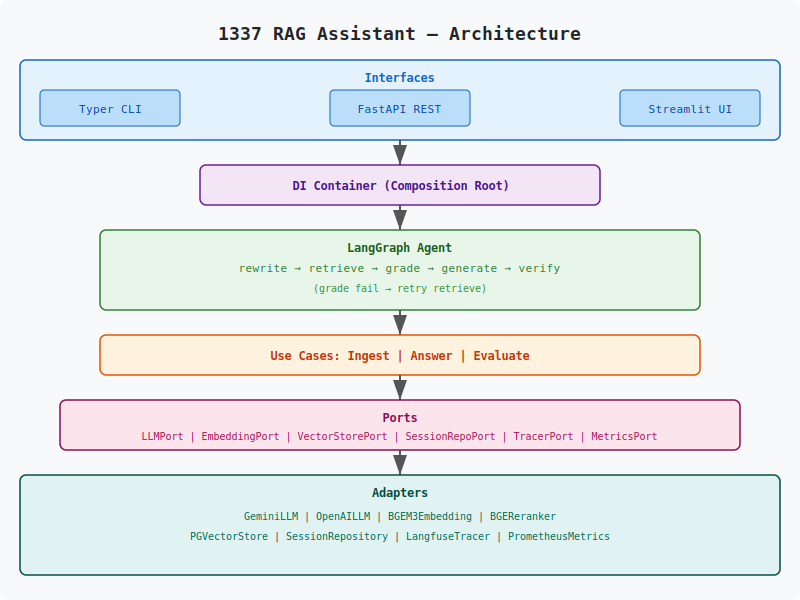

# 1337 RAG Assistant

> Production-grade multilingual agentic RAG for the 1337 Coding School knowledge base.

[](.github/workflows/ci.yml)
[](LICENSE)
[](https://www.python.org/)

## Features

- Hexagonal (Ports & Adapters) architecture — domain isolated from infrastructure
- Agentic RAG with LangGraph: retrieve → rerank → answer with citations
- Hybrid retrieval (dense BGE-M3 + sparse BM25, fused via Reciprocal Rank Fusion)
- Multilingual: English, French, Arabic (auto-detected)
- Three interfaces: CLI, FastAPI REST, Chainlit web
- Pluggable LLM providers: Gemini and OpenAI behind a single port
- Observability: Langfuse traces, Prometheus metrics, Grafana dashboards, Loki logs
- Continuous evaluation with Ragas (faithfulness, answer relevancy, context precision/recall)
- 100% Dockerized — one-command demo via `make demo`

## Architecture

The system follows hexagonal architecture: the `domain` layer holds pure business rules
and abstract ports, the `application` layer orchestrates use cases (ingest, answer,
evaluate), the `infrastructure` layer provides concrete adapters (Gemini, OpenAI,
pgvector, multilingual-e5-small, Langfuse, Prometheus), and the `interface` layer exposes CLI, REST,
and web entry points. Swapping an adapter (e.g., Gemini → OpenAI, pgvector → Qdrant)
requires implementing one interface — the domain stays untouched.

See [`docs/ARCHITECTURE.md`](docs/ARCHITECTURE.md) for diagrams and request lifecycles.



## Quickstart

```bash
git clone https://github.com/abizyane/Ai-Assistant.git
cd Ai-Assistant
cp .env.example .env       # set RAG_LLM__API_KEY
make demo                  # builds, starts, seeds, prints URLs
```

After `make demo`:

| Service       | URL                              |
|---------------|----------------------------------|
| Chainlit UI   | http://localhost:8502            |
| FastAPI docs  | http://localhost:8000/docs       |
| Langfuse      | http://localhost:3000            |
| Grafana       | http://localhost:3001            |
| Prometheus    | http://localhost:9090            |
| Loki          | http://localhost:3100            |

## Available commands

| Target            | Description                                              |
|-------------------|----------------------------------------------------------|
| `make demo`       | Spin up full stack, seed demo data, print URLs           |
| `make chainlit`   | Open Chainlit UI in your default browser                 |
| `make ingest`     | Ingest documents from data/knowledge_base/ into the vector store |
| `make up`         | Start the stack (detached, healthchecks)                 |
| `make down`       | Stop containers (volumes preserved)                      |
| `make fclean`     | Destroy everything: containers, volumes, images, caches, runtime data |
| `make test`       | Run full test suite with coverage gate                   |
| `make eval`       | Run Ragas evaluation; fail if thresholds breached        |
| `make smoke`      | Run smoke test against live stack                        |
| `make logs`       | Tail all container logs                                  |

Run `make help` for the full list.

## Project structure

```
.
├── alembic/              # Database migrations (versions, env, script template)
├── data/knowledge_base/  # Source corpus
├── docs/                 # Architecture, evaluation, observability docs
├── evals/                # Ragas golden set + validation utilities
├── infra/                # Prometheus rules, Grafana dashboards, Loki config
├── scripts/              # seed_demo.py, smoke.py
├── src/
│   ├── config/           # pydantic-settings (env vars, RAG_ prefix)
│   ├── domain/           # Entities + ports (pure, no I/O)
│   ├── application/      # Use cases + LangGraph agent
│   ├── infrastructure/   # Adapters (LLM, embeddings, vector store, …)
│   ├── interface/        # FastAPI, Typer CLI, Chainlit
│   └── shared/           # Cross-cutting types, exceptions, utils
├── tests/                # unit, integration, e2e
├── docker-compose.yml
├── Dockerfile
├── Makefile
└── pyproject.toml
```

## Tech stack

- **LLMs**: Gemini 2.0 Flash (`langchain-google-genai`), OpenAI (`langchain-openai`)
- **Retrieval**: multilingual-e5-small dense embeddings (384-dim), BM25 sparse, BGE-reranker-v2-m3 cross-encoder
- **Storage**: PostgreSQL + pgvector (HNSW index), Alembic migrations
- **Agent**: LangGraph (explicit state machine)
- **Observability**: Langfuse (traces), Prometheus (metrics), Grafana (dashboards), Loki (logs)
- **Interfaces**: FastAPI + Uvicorn, Typer CLI, Chainlit
- **Dev tooling**: uv, ruff, mypy strict, pytest, testcontainers, Ragas

## Documentation

- [`docs/ARCHITECTURE.md`](docs/ARCHITECTURE.md) — layered design, ports/adapters, request lifecycles
- [`docs/EVALUATION.md`](docs/EVALUATION.md) — Ragas methodology, golden set, CI gating
- [`docs/OBSERVABILITY.md`](docs/OBSERVABILITY.md) — tracing, metrics, dashboards, alerting

## License

MIT — see [LICENSE](LICENSE).
